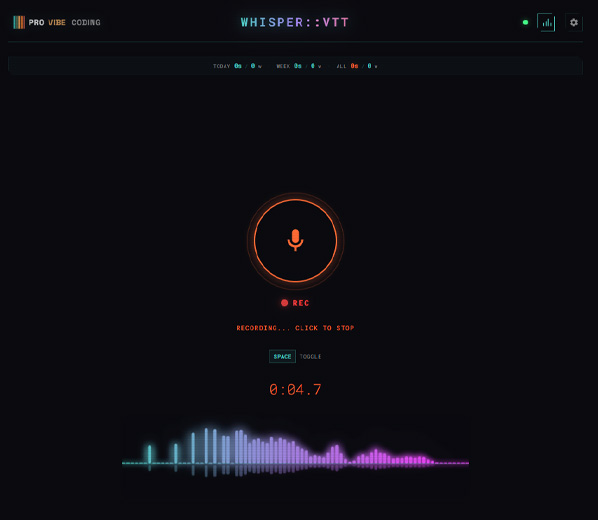

# Whisper VTT

**Local voice-to-text transcription.** No cloud, no API keys, no subscriptions. 100% offline, 100% private.

Built with [faster-whisper](https://github.com/SYSTRAN/faster-whisper) (OpenAI's Whisper, 4x faster) and a retro-styled browser UI.


## Preview

|                       Boot Screen                        |              Main App              |
| :------------------------------------------------------: | :--------------------------------: |
|  |  |

## Features

- **Click to record** — hit the mic button or press Space
- **Real-time waveform** — retro frequency visualizer while recording
- **Auto-copy** — transcription copied to clipboard automatically
- **Multiple models** — tiny (75MB) to turbo (1.6GB), pick your speed/quality trade-off
- **CPU or GPU** — works on any machine, CUDA optional for speed
- **Time-saved stats** — tracks how much time you've saved vs typing
- **Configurable keybinds** — keyboard or mouse button shortcuts
- **Zero telemetry** — nothing leaves your machine, ever

## Quick Start

```bash
# Clone
git clone https://github.com/nicobailon/whisper-vtt.git
cd whisper-vtt

# Install dependencies
pip install -r requirements.txt

# Run
python server.py
```

Open **http://localhost:5000** in your browser. That's it.

First run downloads the Whisper model (~150MB for `base`). Subsequent starts are instant.

## GPU Acceleration (Optional)

For NVIDIA GPU support, install CUDA-enabled packages:

```bash
pip install torch --index-url https://download.pytorch.org/whl/cu121
```

Then update `config.json`:

```json
{
  "device": "cuda",
  "compute_type": "float16"
}
```

## Configuration

Settings can be changed via the browser UI (gear icon) or by editing `config.json`:

| Setting        | Default   | Description                                               |
| -------------- | --------- | --------------------------------------------------------- |
| `model`        | `base`    | Whisper model: `tiny`, `base`, `small`, `medium`, `turbo` |
| `model_path`   | `.models` | Where model files are cached                              |
| `device`       | `cpu`     | `cpu` or `cuda`                                           |
| `compute_type` | `int8`    | `int8` (CPU), `float16` (GPU), `float32` (fallback)       |
| `port`         | `5000`    | Server port                                               |

## Recommended Setup

For the best transcription quality, use the **turbo** model with GPU acceleration. This is what we use daily:

```json
{
  "model": "turbo",
  "device": "cuda",
  "compute_type": "float16",
  "port": 5000
}
```

The server also uses these optimized transcription settings out of the box:

- **`beam_size: 5`** — better accuracy than greedy decoding
- **`vad_filter: true`** — voice activity detection skips silence automatically
- **`no_speech_threshold: 0.3`** — tries harder to decode quiet/mumbled speech (default is 0.6)
- **`condition_on_previous_text: true`** — uses prior segments as context for more coherent output

If you know your language ahead of time, you can hardcode it in `server.py` by adding `language="en"` (or your language code) to the `model.transcribe()` call. This skips auto-detection and speeds things up.

## Models

| Model     | Size        | Speed    | Quality       | Notes                         |
| --------- | ----------- | -------- | ------------- | ----------------------------- |
| tiny      | ~75 MB      | fastest  | basic         | Good for quick notes          |
| base      | ~150 MB     | fast     | good          | Default — solid balance       |
| small     | ~500 MB     | medium   | great         | Noticeable quality jump       |
| medium    | ~1.5 GB     | slow     | excellent     | Diminishing returns vs turbo  |
| **turbo** | **~1.6 GB** | **fast** | **excellent** | **Best pick if you have GPU** |

> **Our recommendation:** `turbo` + CUDA. It's as accurate as `medium` but 8x faster. First download is ~1.6GB, then it's cached locally.

## Tech Stack

- **Backend:** Python, Flask, faster-whisper
- **Frontend:** Vanilla HTML/CSS/JS (no frameworks, no build step)
- **Database:** SQLite (stats only)
- **Design:** Futuretro aesthetic (CRT scanlines, chamfered corners, teal/orange palette)

## License

Apache 2.0 — see [LICENSE](LICENSE)

---

Made by [Pro Vibe Coding](http://provibecoding.app)
